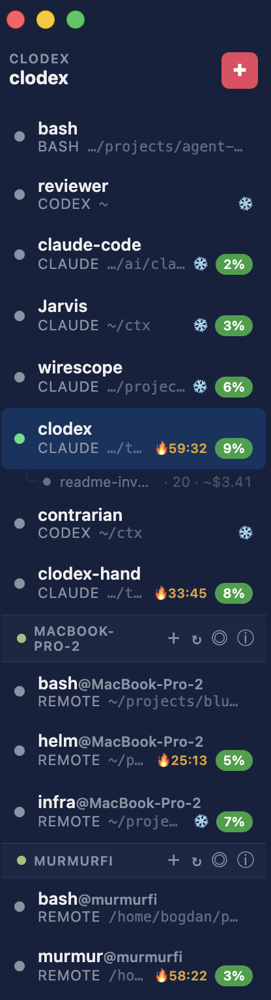

# Clodex

A visual multi-agent PTY manager for **Cl**aude Code and C**odex** CLIs. Run multiple agent sessions side-by-side in a single Mac app, with built-in inter-agent messaging — agents can DM each other, broadcast updates, and discover peers.



## What it does

- **Sidebar with agent sessions** — switch between Claude, Codex, and bash sessions with a click
- **Embedded xterm.js terminals** — each session is a real PTY with full terminal support
- **Inter-agent IPC** — agents can write `[cli:dm bob] hello` in their responses to message each other; DMs land in the recipient's stdin as `[from alice] hello`. Sidebar tab pulses amber when a session receives a message.
- **Multi-window workspaces** — each window is a workspace with its own session set; restored on relaunch. Broadcast and `[cli:who]` are workspace-scoped; DM is global by agent name.
- **Live context indicator** — for Claude sessions, sidebar shows a color-coded badge (green/orange/red) with the current context window usage
- **Prompts library** — save reusable prompts and either inject them into a running session or seed a new one as a system prompt
- **Templates** — save New Session dialog configs and pick them from a dropdown
- **Edit args mid-stream** — right-click a session → "Edit Args…" to update its CLI args; choose to apply on next spawn or restart immediately (sessionId is preserved across restart)
- **Customizable statusline** — via Preferences (⌘,), pick which components show in Claude and Codex statuslines
- **Persistence** — sessions resume across app restarts via `claude --resume` / `codex resume`
- **Self-contained runtime** — registry, sockets, and message files live under `~/.clodex/`, owned entirely by Clodex

## Install

Download the latest DMG from [Releases](https://github.com/avirtual/clodex/releases):

- **Apple Silicon (M1/M2/M3/M4)**: `Clodex-x.y.z-arm64.dmg`
- **Intel Macs**: `Clodex-x.y.z.dmg`

Open the DMG, drag **Clodex** to your Applications folder.

### First launch

Clodex is **ad-hoc signed** but not notarized by Apple (no $99/year developer cert). On first launch:

1. Right-click `Clodex.app` in Applications → **Open**
2. Click **Open** in the warning dialog
3. From now on, double-click works normally

If you see *"Clodex is damaged and can't be opened"*, run:

```bash
xattr -cr /Applications/Clodex.app
```

This removes macOS's quarantine flag, which is added to anything downloaded from the internet.

## Requirements

- macOS 10.12+
- [Claude Code CLI](https://docs.claude.com/en/docs/claude-code) (`claude` in PATH) — for Claude sessions
- [Codex CLI](https://github.com/openai/codex) (`codex` in PATH) — for Codex sessions

## Usage

1. Click **+** in the sidebar (or press ⌘T)
2. Choose a name, type (claude/codex/bash), and working directory
3. Optionally pick a **System Prompt** from your library to seed the session
4. Hit **Create** — terminal appears, agent starts
5. Click sidebar items (or press ⌘1…9) to switch between them

### Inter-agent messaging

Once two or more agent sessions are running, they can message each other. Just talk to Claude/Codex normally — the protocol is injected as a system prompt at spawn time. Examples:

- *"Who is online?"* → agent writes `[cli:who]` → gets `[peers] alice, bob`
- *"DM bob and ask him to check the failing test"* → agent writes `[cli:dm bob] please check the failing test` → bob receives it as `[from alice] please check the failing test`
- *"Tell everyone the build is broken"* → `[cli:broadcast] heads up, build is broken on main`

Bash sessions are private terminals — they don't participate in IPC.

**Scoping:** `[cli:broadcast]` and `[cli:who]` are scoped to the sender's workspace — they only see agents in the same window. `[cli:dm <name>]` is global: if an agent by that name exists in any workspace, it'll receive the DM.

### Prompts library

Click the 📝 icon in the sidebar header to open the library. Save reusable prompts, then either:

- **Inject** a prompt into the active session (types it into the PTY like you pasted it)
- **Seed** a new session with it — the New Session dialog has a "System Prompt" dropdown that attaches the prompt at launch (Claude: `--append-system-prompt-file`; Codex: `model_instructions_file`)

### Workspaces

`⌘⇧N` opens a new workspace window. Each workspace has its own sidebar of sessions. Close a window and the sessions keep running in the background; reopen it from the tray or the Window menu. Only the most-recently-focused workspace opens on startup (IDE-style). "Close Workspace Permanently" from the Window menu kills its sessions and removes the record.

### Preferences

`⌘,` opens the Preferences dialog. Today it controls the statusline:

- **Claude**: pick any of model name, context % (real-time), session cost, working directory, git branch. Session name (`[clodex:NAME]`) is always shown.
- **Codex**: pick any native components Codex supports (context-used, model-name, project-root, git-branch, five-hour-limit, current-dir, context-remaining, model-with-reasoning).

Running Claude sessions update live. Codex sessions pick up changes on next spawn.

### Keyboard shortcuts

- `⌘T` new session
- `⌘⇧N` new workspace window
- `⌘,` Preferences
- `⌘W` close/kill active session (with confirm) or close dialog
- `⌘1` … `⌘9` switch session by index
- `⌘⇧]` / `⌘⇧[` next / previous session
- `⌘F` terminal search

## Building from source

```bash
git clone https://github.com/avirtual/clodex
cd clodex
npm install            # postinstall also renames dev Electron.app to Clodex
npm start              # dev mode
npm run dist:mac       # build .dmg + .zip for both archs
```

## How it works

Each agent session is a node-pty subprocess running `claude` or `codex`. Clodex does three things at spawn:

1. **Registers on `~/.clodex/{name}.sock`** so messages can be delivered across Clodex windows.
2. **Installs a SessionStart hook** that creates a symlink (`~/.clodex/{name}.jsonl`) pointing at the agent's transcript file.
3. **Injects the IPC protocol as a system prompt** — `--append-system-prompt-file` for Claude, `-c model_instructions_file=…` for Codex — so the agent knows the `[cli:…]` intents it can emit.

A watcher tails the JSONL (seeking to EOF on first open so past turns don't re-fire), extracts assistant text, and scans it for `[cli:…]` intents. Matching intents get routed to the target session's PTY stdin. Messages larger than 500 bytes spill to `~/.clodex/messages/` and are delivered as a pointer for the recipient to read via its file-access tool.

Persistent data lives under `~/Library/Application Support/Clodex/`:
- `sessions.json` — one entry per session with name, type, cwd, extraArgs, sessionId (for resume), workspaceId, label
- `workspaces.json` — id, name, bounds, `lastFocusedAt`
- `prompts.json` — saved prompts
- `templates.json` — saved new-session dialog configs
- `ui-settings.json` — statusline component choices

Clodex is derived from the [wb-wrap project](https://github.com/bogdan/wb-wrap), a proof-of-concept CLI version of the same idea. As of v0.6.6 they are independent: Clodex owns its runtime dir (`~/.clodex/`) and no longer shares the `/tmp/wb-wrap/` namespace with wb-wrap sessions.

## License

MIT
